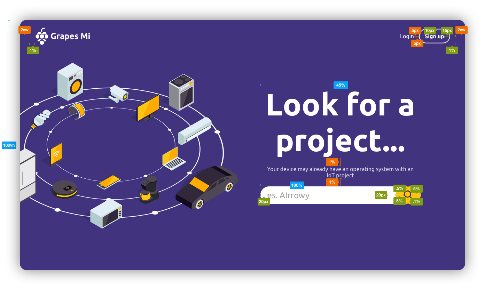
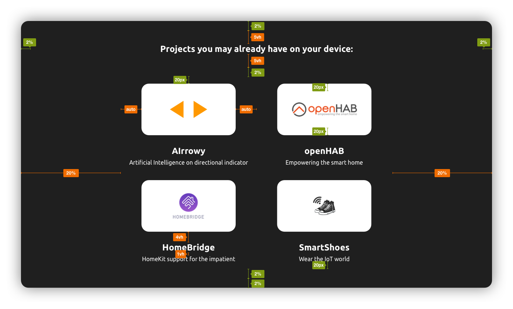
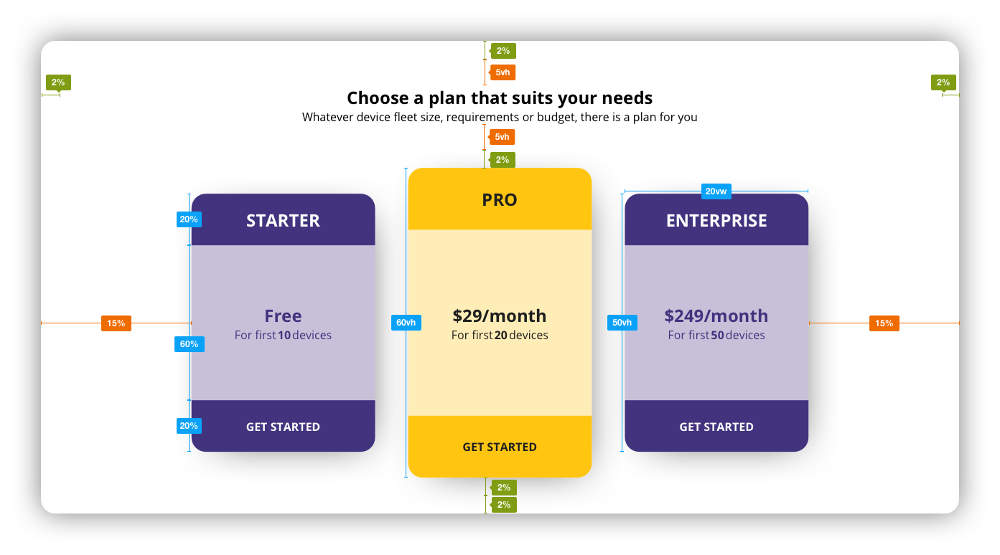
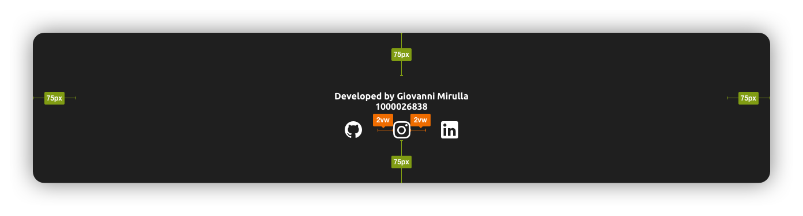

# Grapes Mi
### Mini homework 1 - MHW1 - Web Programming - UNICT
Servizio hosting per progetti software IoT che verranno compilati e distribuiti via OTA a tutti i dispositivi collegati dagli utenti

- [Website](https://giovannimirulla.github.io/GrapesMi/mhw1.html)
- [PowerPoint](https://github.com/giovannimirulla/GrapesMi/main/mhw1.pptx)

## Header

## Project Section

## Plans Section

## Footer

